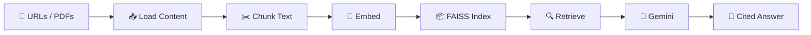

<div align="center">

# 🧠 LexaRAG

**AI-Powered News Research Assistant**

Paste news article URLs or upload PDFs — ask questions, get cited answers powered by RAG.

[](https://python.org)
[](https://streamlit.io)
[](https://ai.google.dev)
[](https://langchain.com)
[](https://github.com/facebookresearch/faiss)
[](https://huggingface.co)
[](https://pypdf.readthedocs.io)
[](LICENSE)

</div>

---

## ✨ Features

- 🔗 **Multi-URL Ingestion** — Analyze up to 3 news articles at once
- 📄 **PDF Upload** — Upload up to 3 PDFs alongside URLs
- 🧠 **Semantic Search** — FAISS + HuggingFace embeddings for precise retrieval
- ⚡ **Gemini AI** — Fast, accurate answers with source citations
- 💬 **Chat History** — Conversational memory for follow-up questions
- 🎨 **Premium Dark UI** — Custom styled with animations and gradients

---

## 📁 Project Structure

```
news/
├── main.py                   # Streamlit app — UI, chat, orchestration
├── config.py                 # Configuration & model registry
├── core/
│   ├── __init__.py
│   ├── document_processor.py # URL loading, PDF loading, text splitting
│   ├── llm_manager.py       # LLM init, RAG chain builder
│   └── vector_store.py      # FAISS vector store lifecycle
├── requirements.txt
├── .env                      # API keys (not committed)
└── README.md
```

---

## 🚀 Quick Start

**Prerequisites:** Python 3.10+ · [Google Gemini API Key](https://aistudio.google.com/apikey)

```bash
# Clone
git clone https://github.com/your-username/lexarag.git
cd lexarag

# Setup environment
python3 -m venv venv
source venv/bin/activate        # macOS/Linux
# venv\Scripts\activate         # Windows

# Install dependencies
pip install -r requirements.txt

# Configure API key
echo 'GOOGLE_API_KEY="your_key_here"' > .env

# Run
streamlit run main.py
```

App opens at **http://localhost:8501**

---

## 🎯 How It Works



1. Paste URLs and/or upload PDFs in the sidebar
2. Click **Process** — articles are loaded, chunked, and embedded
3. Ask questions in the chat
4. Get cited answers with source links (🔗 for URLs, 📄 for PDFs)

---

## ⚙️ Configuration

All settings in `config.py`:

| Parameter | Default | Description |
|-----------|---------|-------------|
| `chunk_size` | `500` | Characters per chunk |
| `chunk_overlap` | `100` | Overlap between chunks |
| `embedding_model` | `all-mpnet-base-v2` | HuggingFace sentence transformer |
| `retriever_top_k` | `5` | Chunks retrieved per query |
| `temperature` | `0.1` | LLM randomness |
| `max_urls` | `3` | Max URL inputs |

---

## 🔧 Troubleshooting

| Issue | Fix |
|-------|-----|
| 429 Rate Limit | Wait 60s or use a new API key |
| 404 Model Not Found | Update `model_id` in `config.py` |
| Slow First Load | Embedding model (~420MB) downloads once |
| GOOGLE_API_KEY not set | Create `.env` — see Quick Start |

---

## 📝 License

MIT — see [LICENSE](LICENSE)

---

<div align="center">
  <b>Built with ❤️ by Siddharth Prajapati</b>
</div>
