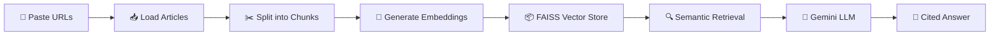

# 🧠 RockyBot — AI-Powered News Research Assistant

[](https://python.org)
[](https://streamlit.io)
[](https://ai.google.dev)
[](https://langchain.com)
[](LICENSE)

A production-ready **RAG (Retrieval-Augmented Generation)** application that lets you research news articles using natural language. Paste any news article URL, and RockyBot will analyze it and answer your questions with source citations — powered by Google Gemini and FAISS vector search.

---

## ✨ Features

| Feature | Description |
|---------|-------------|
| 🔗 **Multi-URL Ingestion** | Analyze up to 3 news articles simultaneously with URL validation and deduplication |
| 🧠 **Semantic Search** | FAISS vector store with normalized HuggingFace embeddings for precise retrieval |
| ⚡ **Gemini AI** | Google's Gemini 2.5 Flash for fast, accurate, well-structured answers |
| 💬 **Chat History** | Full conversational memory — ask follow-up questions naturally |
| 📄 **Source Citations** | Every answer includes links to the original source articles |
| ⏱ **Response Metrics** | See response time for each answer |
| 🎨 **Premium Dark UI** | Custom-styled Streamlit interface with animations and gradient accents |
| 🛡️ **Error Handling** | User-friendly error messages for rate limits, invalid URLs, and API issues |

---

## 📁 Project Structure

```
news/
├── main.py                  # Streamlit app — UI, chat, and orchestration
├── config.py                # Centralized configuration & model registry
├── core/                    # Core business logic modules
│   ├── __init__.py
│   ├── document_processor.py  # URL validation, loading, text splitting
│   ├── llm_manager.py        # LLM init, caching, RAG chain builder
│   └── vector_store.py       # FAISS vector store lifecycle
├── requirements.txt         # Pinned Python dependencies
├── .env                     # API keys (not committed to git)
├── .gitignore
└── README.md
```

---

## 🚀 Quick Start

### Prerequisites

- **Python 3.10+**
- **Google Gemini API Key** — get one free at [Google AI Studio](https://aistudio.google.com/apikey)

### 1. Clone the Repository

```bash
git clone https://github.com/your-username/rockybot-news-research.git
cd rockybot-news-research
```

### 2. Create a Virtual Environment

```bash
python -m venv venv
source venv/bin/activate        # macOS/Linux
# venv\Scripts\activate         # Windows
```

### 3. Install Dependencies

```bash
pip install -r requirements.txt
pip install langchain-google-genai
```

### 4. Configure API Key

Create a `.env` file in the project root:

```env
GOOGLE_API_KEY="your_google_api_key_here"
```

### 5. Run the App

```bash
streamlit run main.py
```

The app will open in your browser at **http://localhost:8501**.

---

## 🎯 How It Works



1. **URL Ingestion** — Paste up to 3 news article URLs in the sidebar
2. **Document Processing** — Articles are loaded, validated, and split into optimized chunks (500 chars, 100 overlap)
3. **Embedding** — Chunks are embedded using `sentence-transformers/all-mpnet-base-v2` with normalized vectors
4. **Vector Store** — FAISS indexes the embeddings for fast similarity search
5. **RAG Query** — Your question is matched against the most relevant chunks (top-5)
6. **LLM Response** — Google Gemini generates a detailed answer based only on the retrieved context, with source citations

---

## 🏗️ Architecture

### `config.py` — Configuration Management

- **Dataclass-based config** with validation
- **Model registry** — easily add new Gemini models
- Environment variable loading via `python-dotenv`
- Tunable parameters: chunk size, overlap, top-k, temperature

### `core/document_processor.py` — Document Processing

- URL validation using `urllib.parse`
- Automatic deduplication of URLs
- Robust error handling with user-friendly messages (SSL, timeout, 404)
- Configurable `RecursiveCharacterTextSplitter`

### `core/llm_manager.py` — LLM Management

- **Cached LLM initialization** via `@st.cache_resource` — loaded once, reused across reruns
- Structured research prompt template
- RAG chain builder using LangChain's `create_retrieval_chain`
- Multi-key source extraction from document metadata

### `core/vector_store.py` — Vector Store

- **Cached embeddings** — model loaded once regardless of reruns
- Normalized embeddings for better similarity matching
- FAISS persistence (save/load to disk)
- Configurable retriever (search type, top-k)

### `main.py` — Streamlit Application

- Premium dark theme with custom CSS (Inter font, gradient accents, animations)
- Session state management for chat history, retriever, and metadata
- Native `st.chat_message` for reliable chat rendering
- Stats dashboard (articles, chunks, avg chars, questions asked)
- Graceful error handling for API rate limits and model availability

---

## ⚙️ Configuration

All settings are centralized in `config.py`. Key parameters:

| Parameter | Default | Description |
|-----------|---------|-------------|
| `chunk_size` | `500` | Characters per text chunk |
| `chunk_overlap` | `100` | Overlap between consecutive chunks |
| `embedding_model` | `all-mpnet-base-v2` | HuggingFace sentence transformer |
| `retriever_top_k` | `5` | Number of chunks retrieved per query |
| `temperature` | `0.1` | LLM response randomness (0 = deterministic) |
| `max_urls` | `3` | Maximum number of URL inputs |

---

## 🔧 Troubleshooting

| Issue | Solution |
|-------|----------|
| **429 Rate Limit Error** | Wait 60 seconds, or generate a new API key from a different Google Cloud project at [aistudio.google.com/apikey](https://aistudio.google.com/apikey) |
| **404 Model Not Found** | The model may be deprecated. Update `model_id` in `config.py` |
| **"Unknown" Sources** | Ensure you're using `UnstructuredURLLoader` without `mode="elements"` |
| **Slow First Load** | The embedding model (~420MB) downloads on first run. Subsequent runs use the cache |
| **GOOGLE_API_KEY not set** | Create a `.env` file with your key. See [Quick Start](#4-configure-api-key) |

---

## 📦 Tech Stack

| Component | Technology |
|-----------|-----------|
| **Frontend** | Streamlit 1.38 with custom CSS |
| **LLM** | Google Gemini 2.5 Flash via LangChain |
| **Embeddings** | HuggingFace `all-mpnet-base-v2` |
| **Vector Store** | FAISS (CPU) |
| **Document Loading** | LangChain `UnstructuredURLLoader` |
| **Text Splitting** | `RecursiveCharacterTextSplitter` |
| **Framework** | LangChain 0.3.7 (LCEL chains) |
| **Config** | Python dataclasses + python-dotenv |

---

## 📝 License

This project is licensed under the MIT License. See [LICENSE](LICENSE) for details.

---

## 🙏 Acknowledgments

- [LangChain](https://langchain.com) — RAG framework
- [Google Gemini](https://ai.google.dev) — LLM API
- [FAISS](https://github.com/facebookresearch/faiss) — Vector similarity search
- [HuggingFace](https://huggingface.co) — Sentence transformers
- [Streamlit](https://streamlit.io) — Web app framework

---

<div align="center">
  <b>Built with ❤️ by Siddharth Prajapati</b>
</div>
